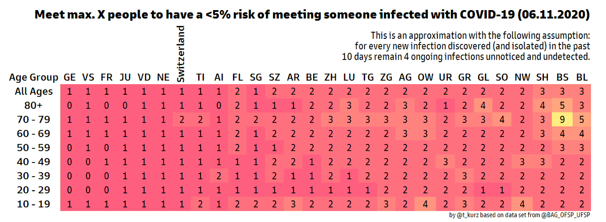

###[WIP] covid19-risk_of_infection

Visualisation of risk of meeting an infectious individual by age group and region using current and modelled data for Slovenia. 

The inspiration for this visualisation comes via [Zarja](https://twitter.com/piskotk) form [this Swiss source]( https://twitter.com/firefoxx66/status/1325187943569481733?s=19 )

